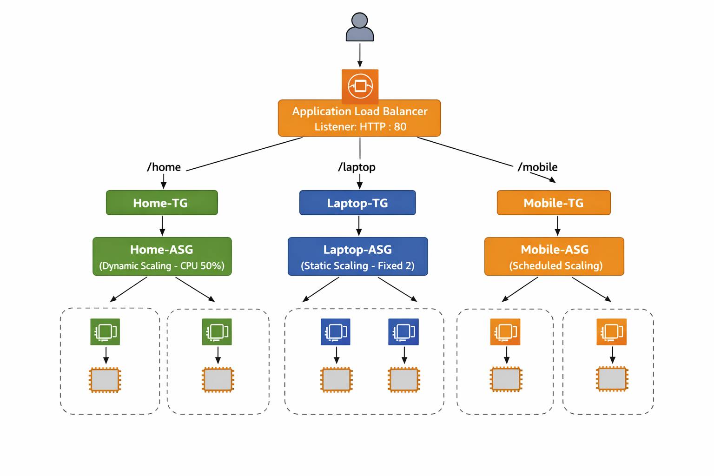
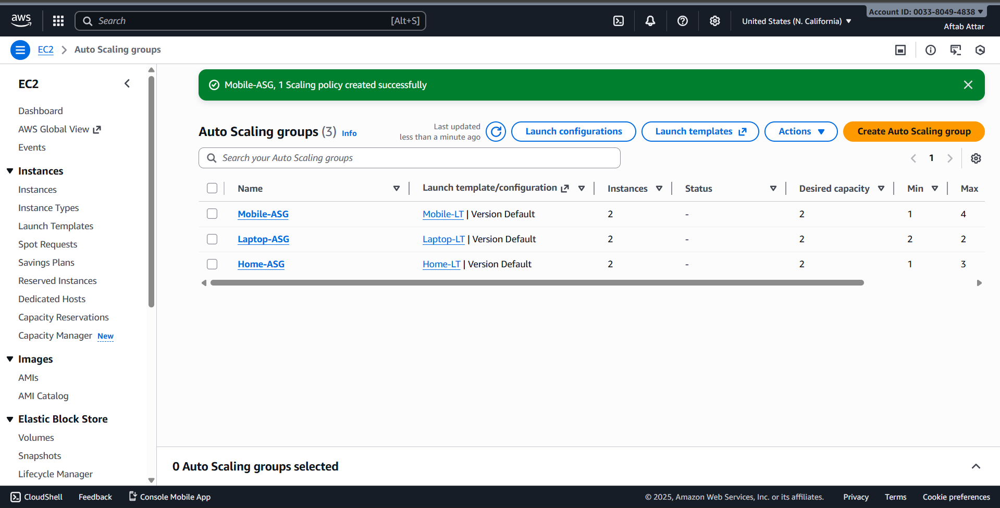

# Auto Scaling Group with Application Load Balancer 

This project demonstrates how to build a scalable AWS architecture using an **Application Load Balancer (ALB)** and **multiple Auto Scaling Groups**, each configured with a different scaling strategy.

---

##  Project Components

- Application Load Balancer (ALB)
- 3 Target Groups
  - Home-TG
  - Laptop-TG
  - Mobile-TG
- 3 Launch Templates
- 3 Auto Scaling Groups
  - Home-ASG → Dynamic Scaling
  - Laptop-ASG → Static Scaling
  - Mobile-ASG → Scheduled Scaling

---

## Architecture Diagram

The ALB routes traffic based on URL paths to different Target Groups.  
Each Target Group is connected to its own Auto Scaling Group.



---

##  Step-by-Step Implementation

---

### Step 1️⃣: Create Security Group

- Allow **HTTP (80)** from anywhere
- Allow **SSH (22)** from your IP
- Same security group used by ALB and EC2 instances

---

### Step 2️⃣: Create Launch Templates

Created three Launch Templates with:
- Amazon Linux 2 AMI
- t3.micro instance type
- Apache (`httpd`) installed using User Data
- Different web content for identification

| Launch Template | Page Served |
|---------------|------------|
| Home-LT | Home Page |
| Laptop-LT | Laptop Page |
| Mobile-LT | Mobile Page |


---

### Step 3️⃣: Create Target Groups

- Target type: **Instance**
- Protocol: **HTTP**
- Port: **80**
- Health check path: `/`

| Target Group |
|-------------|
| Home-TG |
| Laptop-TG |
| Mobile-TG |


---

### Step 4️⃣: Create Application Load Balancer

- Type: Application Load Balancer
- Scheme: Internet-facing
- Listener: HTTP : 80
- Attached to public subnets


---

### Step 5️⃣: Configure ALB Listener Rules

Path-based routing rules configured as:

| Path | Forward To |
|----|----|
| `/home*` | Home-TG |
| `/laptop*` | Laptop-TG |
| `/mobile*` | Mobile-TG |
| Default | Home-TG |


---

### Step 6️⃣: Create Auto Scaling Groups

---

#### 🔹 Home-ASG (Dynamic Scaling)

- Launch Template: Home-LT
- Min: 1 | Desired: 2 | Max: 3
- Scaling Policy:
  - Target Tracking
  - CPU Utilization = 50%


---
#### 🔹 Mobile-ASG (Scheduled Scaling)

- Launch Template: Mobile-LT
- Base capacity:
  - Min: 1 | Desired: 1 | Max: 3
- Scheduled actions:
  - Scale up during peak time
  - Scale down during off-hours


#### 🔹 Laptop-ASG (Static Scaling)

- Launch Template: Laptop-LT
- Fixed capacity:
  - Min = Desired = Max = 2
- No scaling policy attached



---

---

### Step 7️⃣: Verify Target Group Health

- All instances registered in target groups
- Health status shows **Healthy**


---

### Step 8️⃣: Test Application

Access the application using ALB DNS:
```text
http://<ALB-DNS>
http://<ALB-DNS>/laptop/
http://<ALB-DNS>/mobile/
```


---
# Summary
This project demonstrates a scalable AWS web architecture using an Application Load Balancer integrated with multiple Auto Scaling Groups, each implementing a different scaling strategy. An internet-facing Application Load Balancer routes incoming traffic to three separate Target Groups based on URL path patterns (/home, /laptop, /mobile). Each Target Group is backed by its own Auto Scaling Group created using Launch Templates and Amazon EC2 instances running Apache web servers. The Home Auto Scaling Group uses dynamic scaling with CPU-based target tracking, the Laptop Auto Scaling Group maintains a fixed static capacity, and the Mobile Auto Scaling Group uses scheduled scaling to handle predictable traffic patterns. This project highlights key AWS concepts such as path-based routing, launch templates, health checks, automatic instance replacement, and high availability, providing hands-on experience with real-world scaling and load-balancing scenarios.

